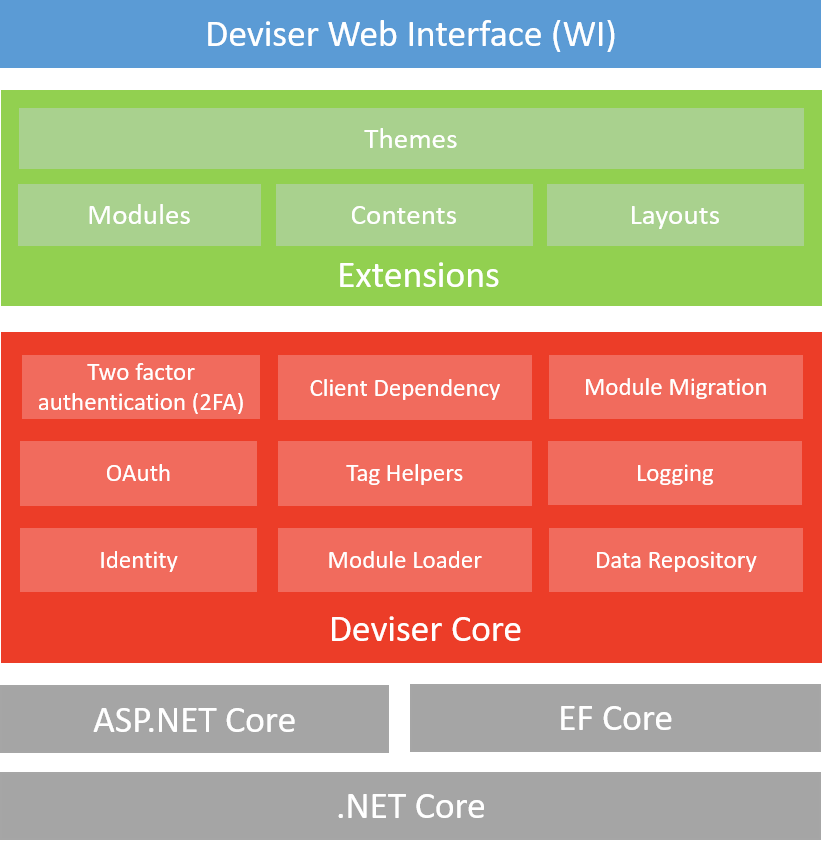

# Concepts and Architecture
Deviser Platform is built on top of ASP.NET Core and Entity Framework Core. The platform consist of three major blocks such as Deviser Core, Extensions and Web Interface. 

### Data Repository 
- Platform database context
- Entities
- data repositories which performs CRUD operations using EF Core 
- Supports data providers: SqlServer, SQLite, PostgreSQL and MySQL

### Logging
Logs all the events and exceptions

### Module Migration
Extension of EF Core Migration where module developers can create separate contexts and maintain the migration.

### Module Loader
Loads all modules added in a page

### Tag Helpers
- Loads the contents and module into appropirate configured layout.
- Form TagHelpers send post to module controllers and routing within module controllers
- Navigation components

### Client Dependency
Manages and prioritzed the JavaScript libraries required by the modules and themes. Similar to [Client Dependency Framework](https://github.com/Shazwazza/ClientDependency) developed by [Shazwazza](https://github.com/Shazwazza).

### Identity and OAuth
This component is built using ASP.NET Core Identity. It provides login functionalities where users can create an account and login with a user name and password or they can use an external login provider such as Facebook, Google, Microsoft Account, Twitter or others.

## Extensions
### Modules
- Based on MVC Area concept
- Controller actions can be configured as module actions
- Module Action can be View or Edit type
- Configured module actions are invoked dynamically at runtime and the Action Result are loaded in the page in response stream.

### Contents
### Themes
### Properties
### Option List 

## Pages and Three Modes
1. View
2. Edit
3. Layout

    