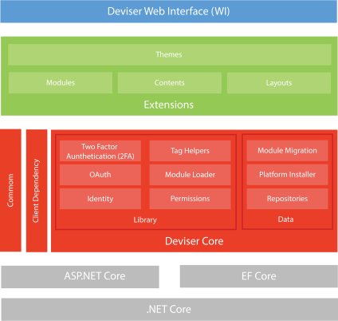
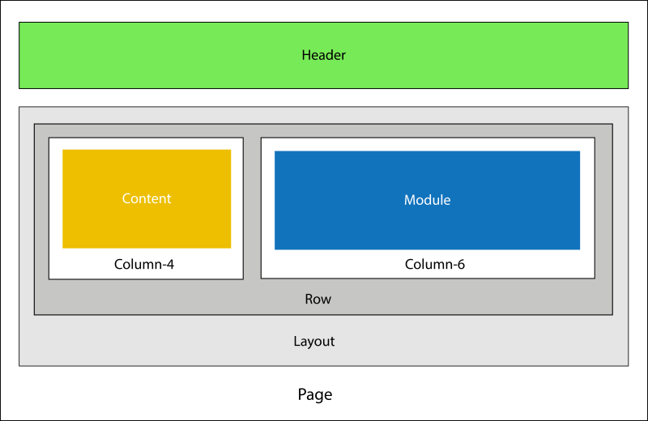

# Concepts and Architecture
Deviser Platform is built on top of ASP.NET Core and Entity Framework Core. The platform consist of three major blocks: Deviser Core, Extensions and Web Interface. 

## Deviser Core
Deviser Core is a base for the platform which contains most of the core functionalities: 
### Data
- **Repositories:** Respository has the functionalities to store and retrieve data from database based on 
<a href="https://martinfowler.com/eaaCatalog/repository.html" target="_blank">Repository Pattern</a>. It supports data providers: SqlServer, SQLite, PostgreSQL and MySQL. 

- **Platform Installer:** This component is used to install the platform on target machine with supported database.
- **Module Migration:** This component is an extension of EF Core Migration which maintains the separate DbContext and database migrations for the modules.

### Library
- **Permissions:** It manages the permissions of the page, module and contents based on user roles.
- **Module Loader:** This component finds the module action, executes and loads the view result. 
- **Tag Helpers:** It loads the contents and moudles in appropirate placeholders of a configured layout. In addition, it provides HTML form post and routing functionalities within module
- **Identity and OAuth:** This component is built using <a href="https://docs.microsoft.com/en-us/aspnet/core/security/authentication/identity?view=aspnetcore-2.1" target="_blank">ASP.NET Core Identiy</a>. It provides login functionalities where users can create an account and login with a user name and password or they can use an external login provider such as Facebook, Google, Microsoft Account, Twitter or others.
- **Two Factory Authentication (2FA):** wo factor authentication (2FA) authenticator apps, using a Time-based One-time Password Algorithm (TOTP), are the industry recommended approach for 2FA. Deviser Platform has implemented this feature, hence developers no need to re-invent this wheel again.
- **Common:** It contains shared functionalities and domain types.
- **Client Dependency:** It loads the JavaScript libraries required by the modules and themes based on the specified priority. This component is similar to <a href="https://github.com/Shazwazza/ClientDependency" target="_blank">Client Dependency Framework</a>.

## Extensions
### Modules
- Based on MVC Area concept
- Controller actions can be configured as module actions
- Module Action can be View or Edit type
- Configured module actions are invoked dynamically at runtime and the Action Result are loaded in the page in response stream.

## Web Interface

### Contents
### Themes
### Properties
### Option List 

## Pages and Three Modes
1. View
2. Edit
3. Layout

    