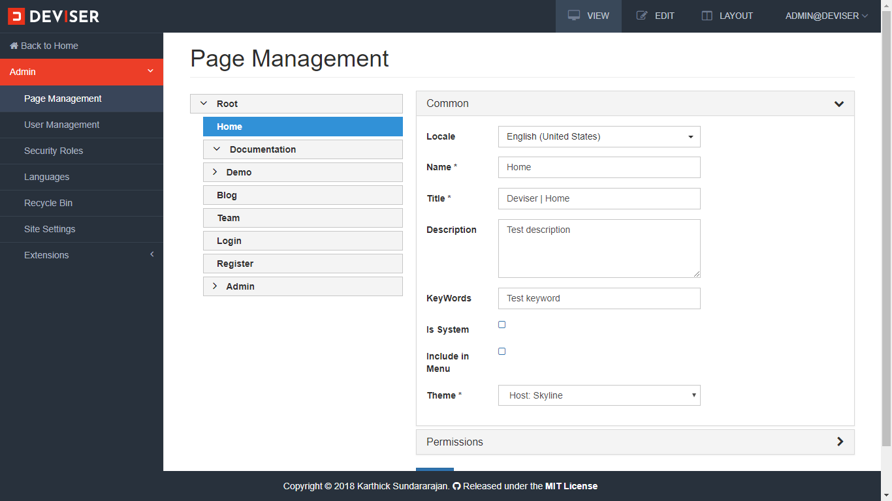
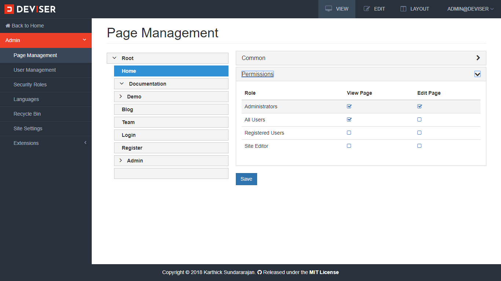

# Page Management
Page is a basic building block of the Deviser Platform where it can host a UI model of the [Deviser Admin](../deviser-admin/index.md) or view of the [Modules](../extensions/modules.md) and [Contents](../extensions/contents.md). This article explains the how to create and manage pages. 

## Crete Page
Navigate to `Admin (click the Deviser logo on top left corner) -> Page Management` to open the page management as shown below.

<video class="video-popup" autoplay muted loop>
  <source src="../../assets/videos/Admin_Pages.mp4" type="video/mp4">
  Your browser does not support HTML5 video.
</video>

Here, left pane displays the tree navigation which lists all the pages in a tree view, where pages can be moved and sorted in multiple levels.

<video class="video-popup" autoplay muted loop>
  <source src="../../assets/videos/Admin_PageSorting.mp4" type="video/mp4">
  Your browser does not support HTML5 video.
</video>

To create a page, hover on an existing page or on a root level and then click "+" button. Enter the page name, description and click **Save** button.

## Update Page
To update a page, select a page from the tree view. Edit the information in "Page Detail" pane and click  **Save** button

## Remove Page
To remove a page, hover on an existing page and click remove button. A confirmation dialog opens up, click **Yes** to delete the page.

## Page Permission
Page permission is a role based permission management component. As described in concepts, a page has two modes: view and edit. Here, administrator can grant view and edit permissions for a page based on the user roles.

>[!NOTE]
>By default, page permissions are inherited to modules and contents (for page type **Standard**). However, if required those inherited permissions can be overridden by the modules and content permissions.