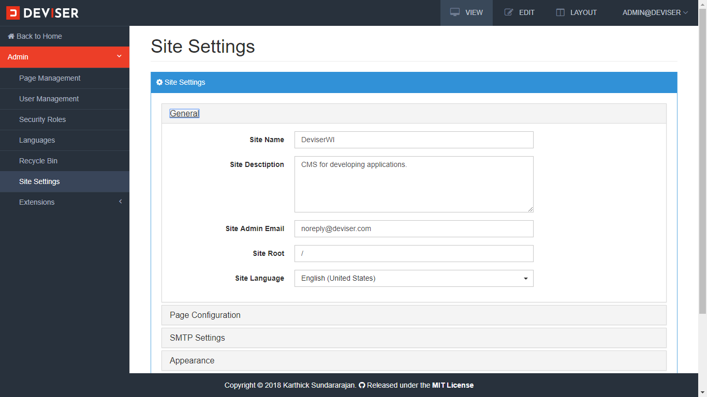
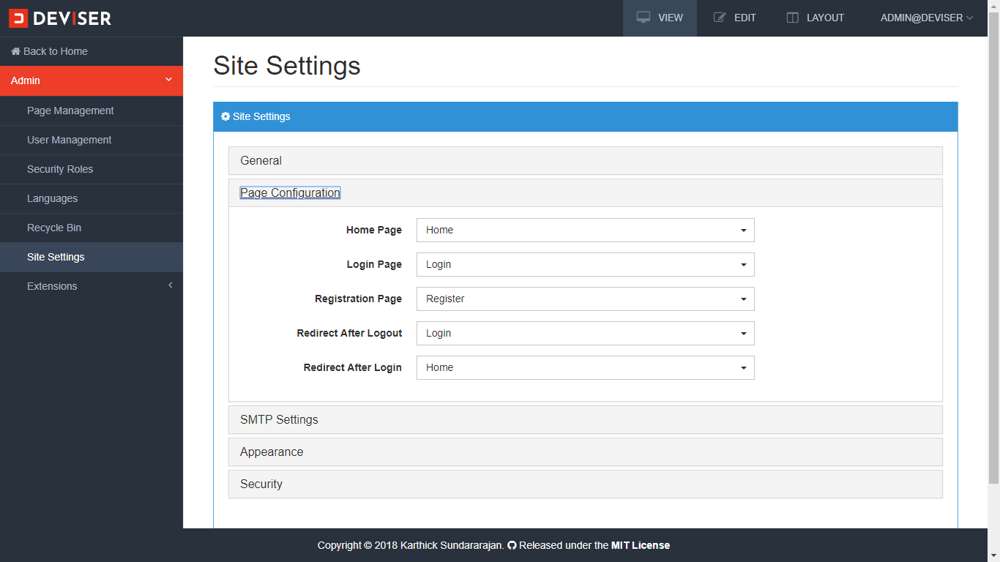
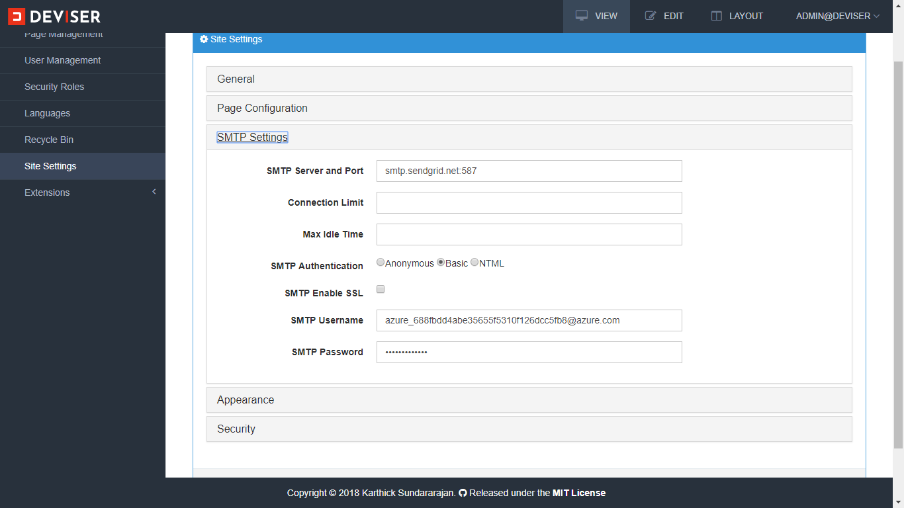
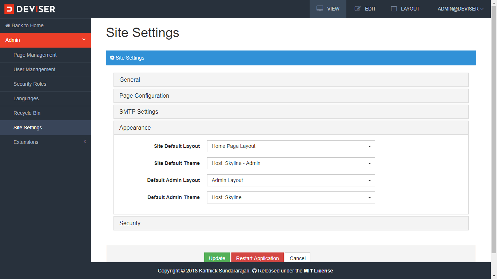
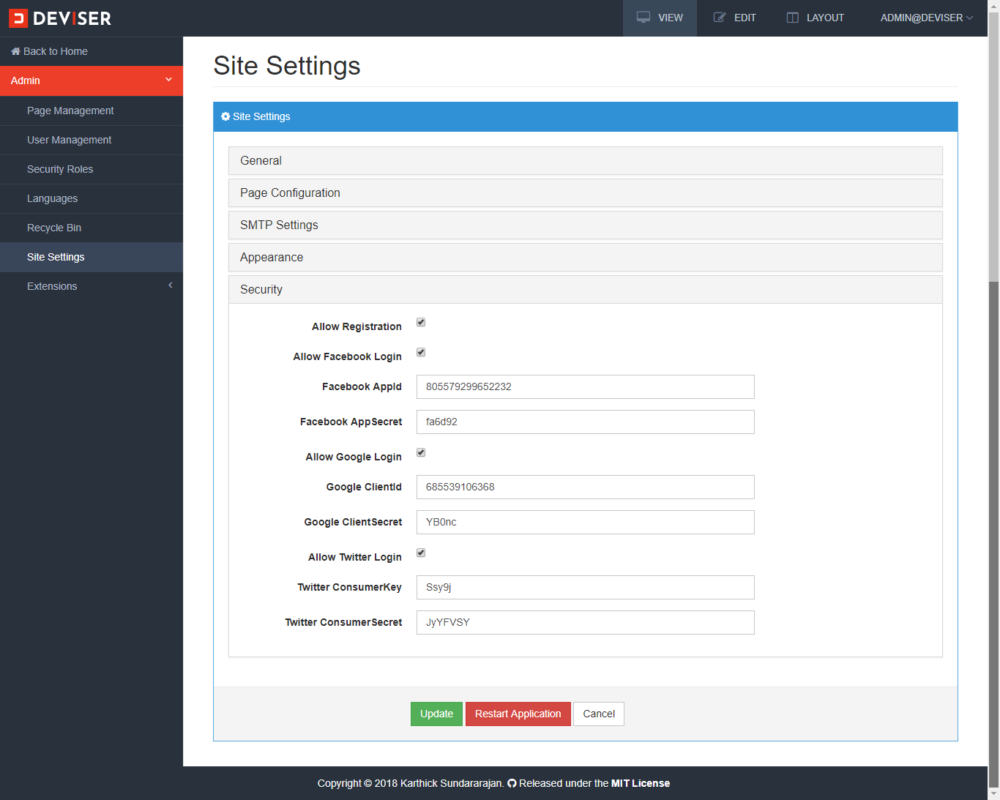

# Site Settings
The Deviser platform is configurable. All the configurations / settings are stored in site settings. Navigate to `Admin (click the Deviser logo on top left corner) -> Site Settings` to open site settings as shown below.

<video class="video-popup" autoplay muted loop>
  <source src="../../assets/videos/Admin_SiteSettings.mp4" type="video/mp4">
  Your browser does not support HTML5 video.
</video>

## General
Site general settings can be updated in this section as shown below.

## Page Configuration
Page configurations such as home page, login page, registration page, redirect page after login, redirect page after logout can be configured in this section as shown below.

## SMTP Settings
SMTP settings can be configured in this section as shown below.

## Appearance
Page default layouts and themes can be configured in this section as shown below.

## Security
The platform security settings can be configured in this section as shown below. 

Here, user registration can be enabled/disabled. In addition, OAuth (Facebook, Google, Twitter) enabled/disabled and their API key can be updated without any programming knowledge.
