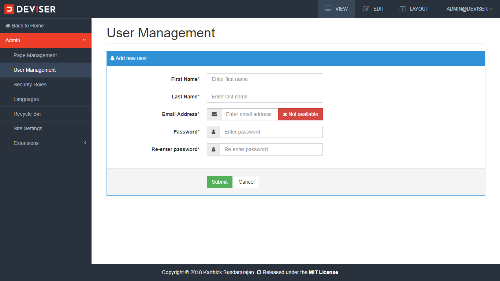
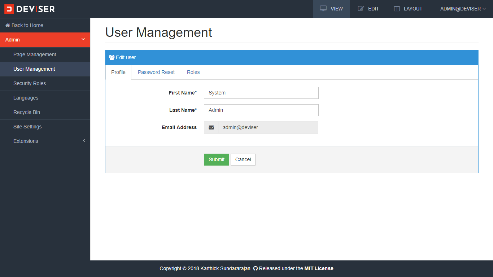
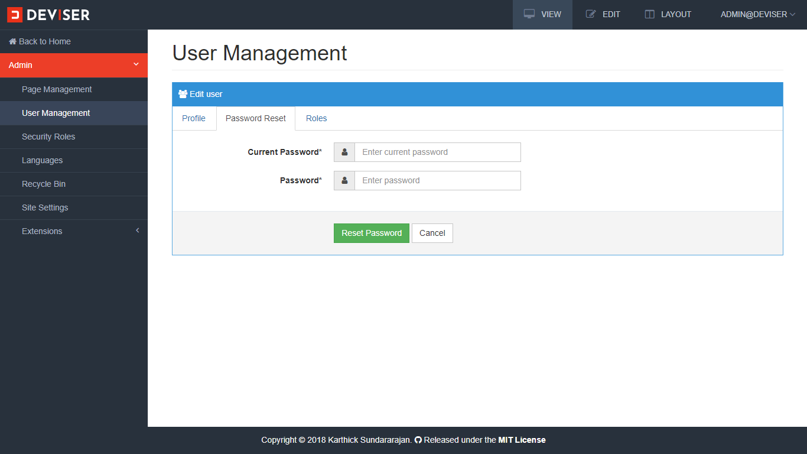
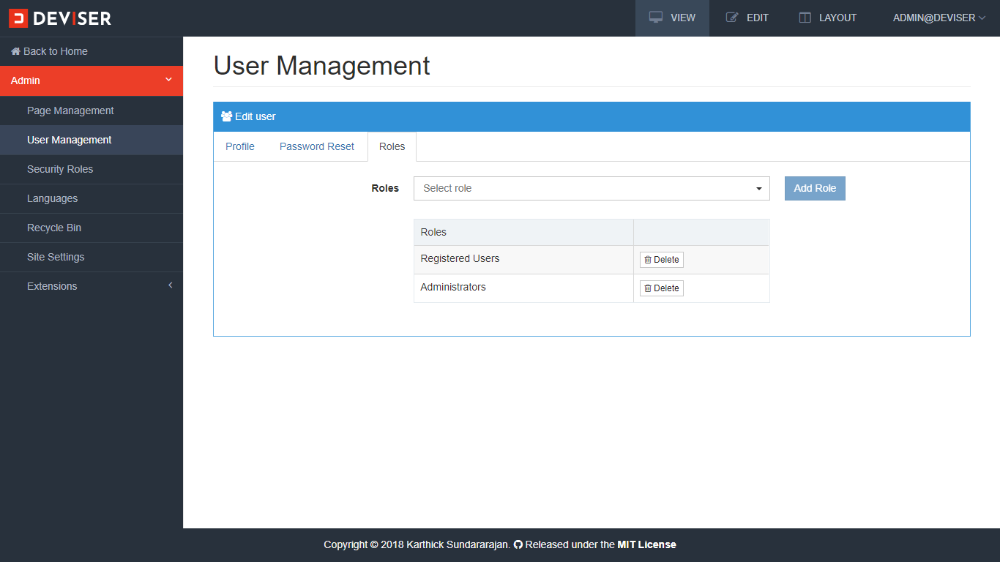

# User Management
User management is used to manage the users and their roles. Navigate to `Admin (click the Deviser logo on top left corner) -> Security Roles` to open user management as shown below.

<video class="video-popup" autoplay muted loop>
  <source src="../../assets/videos/Admin_Users.mp4" type="video/mp4">
  Your browser does not support HTML5 video.
</video>

## Create User
To create a new user click **New User** button, enter the first name, last name, email and password and click **Submit** button.

## Update User
Edit a user and navigate to profile tab to update user information. 

To change password, edit a user and navigate to password reset tab.

## User Roles
To add or remove roles for a user, edit a user and navigate to roles tab as shown below.

## Delete User
Navigate to users over view page and click delete button to delete a user.