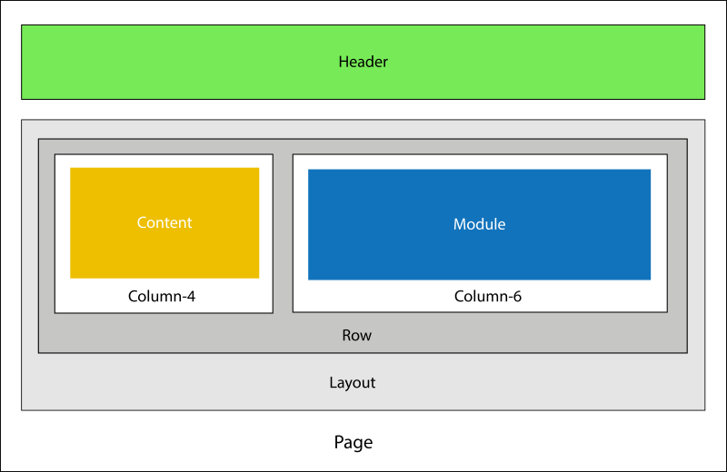
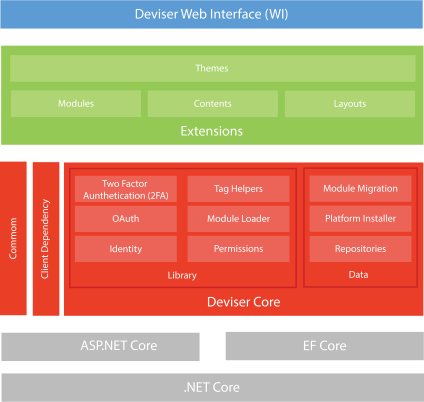

# Concepts
This section explains overview and basic concepts of the Deviser Platform. The following illustration shows the concepts visually:

<!-- # Architecture
Deviser Platform is built on top of ASP.NET Core and Entity Framework Core. The platform consist of three major blocks: Deviser Core, Extensions and Web Interface.  -->

<!--  -->

## Deviser Core
Deviser Core is a base for the platform which built on top of [ASP.NET](https://dotnet.microsoft.com/en-us/apps/aspnet) and [Entity Framework (EF) Core](https://learn.microsoft.com/en-us/ef/core/) contains most of the core functionalities. Deviser Admin most exciting component of the core libraries which helps to build user interfaces based on UI model, for more info see [Deviser Admin](deviser-admin/index.md).

<!-- ### Data
- **Repositories:** Respositories are used to store and retrieve data from database based on 
<a href="https://martinfowler.com/eaaCatalog/repository.html" target="_blank">Repository Pattern</a>. Supported data providers in Deviser Platform are: SqlServer, SQLite, PostgreSQL and MySQL.
- **Platform Installer:** This component is used to install the platform on target machine with supported database.
- **Module Migration:** Module Migration is an extension of EF Core Migration which maintains the separate DbContext and database migrations for the modules.

### Library
- **Permissions:** It manages the permissions of the page, module and contents based on user roles.
- **Module Loader:** This component finds the module action, executes and loads the view result. 
- **Tag Helpers:** It loads the contents and moudles in appropirate placeholders of a configured layout. In addition, it provides HTML form post and routing functionalities within module.
- **Identity and OAuth:** This component is built using <a href="https://docs.microsoft.com/en-us/aspnet/core/security/authentication/identity?view=aspnetcore-2.1" target="_blank">ASP.NET Core Identiy</a>. It provides login functionalities where users can create an account and login with a user name and password or they can use an external login provider such as Facebook, Google, Microsoft Account, Twitter or others.
- **Two Factory Authentication (2FA):** Two factor authentication (2FA) authenticator apps, using a Time-based One-time Password Algorithm (TOTP), are the industry recommended approach for 2FA. Deviser Platform has implemented this feature, hence developers no need to re-invent this wheel again.
- **Common:** It contains shared functionalities and domain types.
- **Client Dependency:** It loads the JavaScript libraries required by the modules and themes based on the specified priority. This component is similar to <a href="https://github.com/Shazwazza/ClientDependency" target="_blank">Client Dependency Framework</a>.

## Extensions
The platform can be extened in following ways:
- **Modules:** Custom functionalities can be implemented in a module and it can be re-used across the platform. For more details read [concepts](#concepts).
- **Contents:** Content is building block which is used to display the dynamic contents. For more details read [concepts](#concepts). 
- **Layouts:** Layout Types are collections of placeholdes which can created dynamically and added to a layout. Once the layout is designed and configured to a page, contents and/or modules can be added to the layout of a page. For more details read [concepts](#concepts).
- **Themes:** Theme is a wrapper of a page where custom HTML strucure and theme specific client resources (css and js) are loaded.

## Web Interface
Web Interface is the UI layer of the deviser platform which is resposible for handling request and rendering the final UI in HTML format.
 -->

## Page
Page is an basic building block of the platform, a typical page contains a Header Componenet, a Layout, Modules and Contents. There are three types of page:
### Standard
A standard page can have layouts, contents and modules
### Admin
An admin page can refer to a admin component
### URL
A URL page simply redirects to a internal or external URL

## Header Component
The Header component is rendered on server side which offers re-useable functionalities such as navigation and [view mode](#three-modes) switcher. This compoment is visible on all pages.

## Layouts
A Layout helps to position modules and contents in a page. A typical layout has layout types such as containers, rows and column as shown in the figure. Developers can create layout by drag-drop layout types. Once the Layout has been created and assigned to a page, modules and contents can be added in an appropirate layout type (place holders).

## Contents
Contents are another building block of the platform and it is dynamic in nature. Dynamic content types enable non-technical users to manage the contents easily. Content types are implemented using AngularJs and Razor templates which later can be used in any pages in the platform. Basic example of content types are: Image Slider, Teams, Accordion and Tabs.

## Module
Module is an extension of <a href="https://docs.microsoft.com/en-us/aspnet/core/mvc/controllers/areas?view=aspnetcore-2.1" target="_blank">Areas</a> in ASP.NET Core. It enables developers to implement fully-customizable functionlities. Once the funcationalities are implemented, it can be added in any pages across the platform.

    