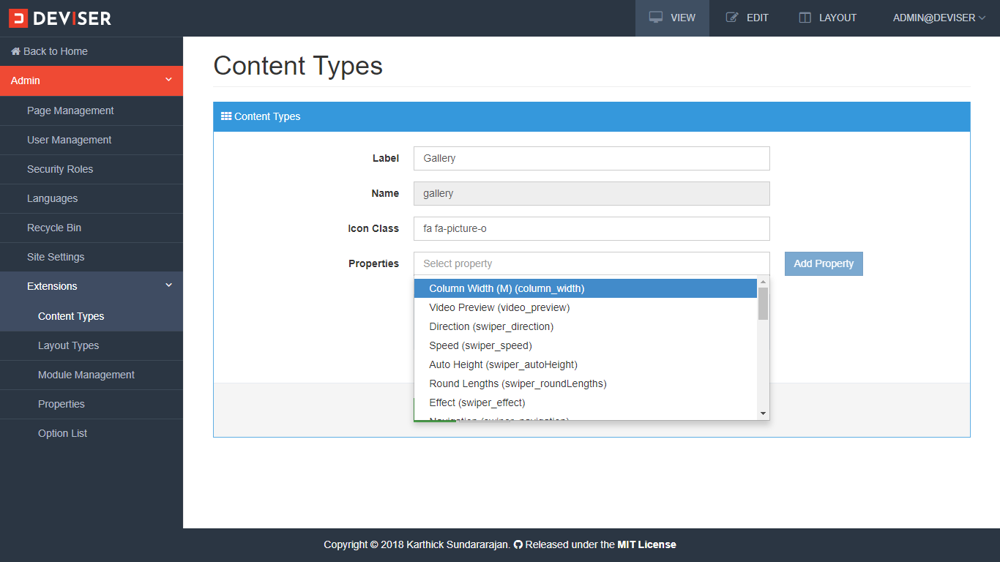
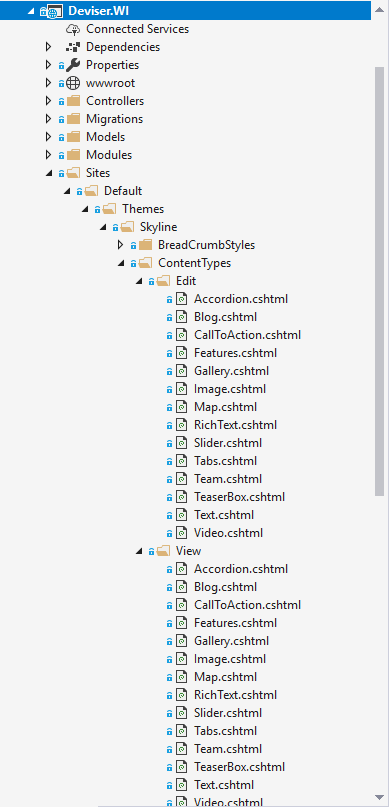

# Contents
Contents in Deviser Platform are dynamic and users can create and configure any number of content types that can be used anywhere across the platform. This article explains process of creating and configuring content types.

## Content Types
Content type is schema of a content and it has the information about the fields, field types and properties.

### Create Content Type
To create a content type navigate to **Admin (click the Deviser logo on top left corner) -> Extensions -> Content Types** Type which opens management view of content types as shown below.

<video class="video-popup" autoplay muted loop>
  <source src="../../assets/videos/Content_OpenContentManagement.mp4" type="video/mp4">
  Your browser does not support HTML5 video.
</video>

>[!NOTE]
>Name of the content type should be unique.

Here, content types can be created, updated and activated/deactivated. For each content type, one or more properties can be added as shown below. Creating and managing properties are explained in [properties](properties.md) section.

>[!NOTE]
>Here, name of the content type should exactly match with the template nams that will be explained in next section.

## Content Templates
Each content type has edit and view templates which are located in `[ApplicationRoot]/Sites/Default/Themes/Skyline/ContentTypes/` as shown below. 

Skyline is the default theme shipped with platform.

### Edit Template
Edit template is an extension of the AngularJs template. It is used to specify one or more fields and their types by using dynamic nature of JavaScript and AngularJs. The name of edit template file (**slider**) and script tag id should exactly match the content type name as shown below.

[!code[Main](../../src/Sites/Default/Themes/Skyline/ContentTypes/Edit/Slider.cshtml?range=1-1)]

In the edit template of slider content type is shown below.

[!code[Main](../../src/Sites/Default/Themes/Skyline/ContentTypes/Edit/Slider.cshtml?range=52-61)]

This slider edit template specifies **title**(text), **description**(multiline text), **imageUrl** and **imageAltText**(image) fields. `dev-image-manager` is an AngularJs component (directives) which is used to upload/select image to the content type.

In addition, the edit template provides possibilities to specify the preview template. The preview of a content type is used to display the content preview in edit mode of a page before editing a content. 

[!code[Main](../../src/Sites/Default/Themes/Skyline/ContentTypes/Edit/Slider.cshtml?range=2-17)]

The complete code of slider edit template is shown below.

[!code[Main](../../src/Sites/Default/Themes/Skyline/ContentTypes/Edit/Slider.cshtml?range=1-)]

### View Template
The view template is based on Razor template which is used to render content as the html. The following example uses slider content and property values to render the slider based on <a href="http://idangero.us/swiper/" target="_blank">Swiper</a>.

[!code[Main](../../src/Sites/Default/Themes/Skyline/ContentTypes/View/Slider.cshtml?range=1-)]