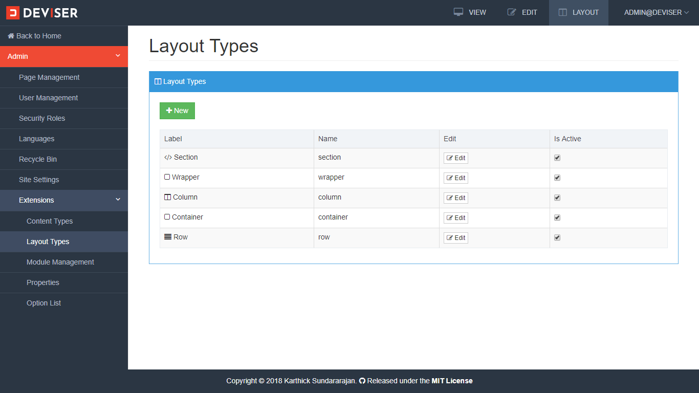
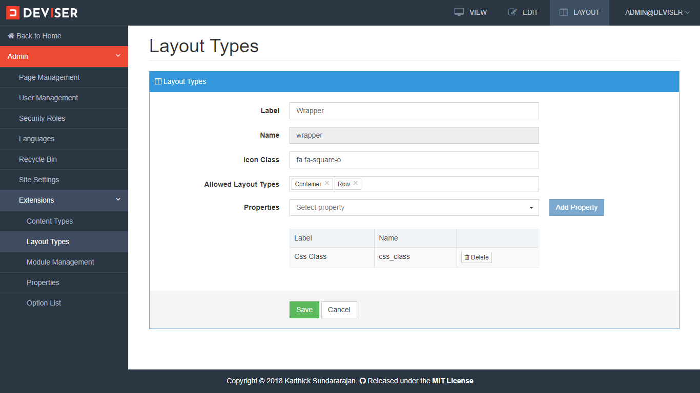
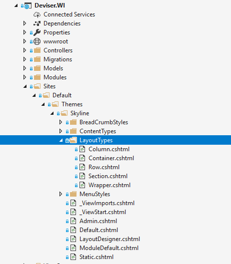
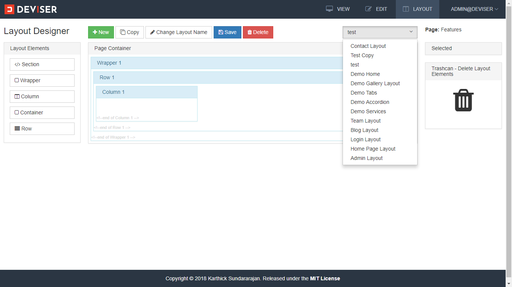

# Layouts
Layouts are the collection of placeholders which are used to position the content and modules in a page. This article explains how to manage layout types and to create, update, delete and assign a layout to a page. 

## Layout Types
Layout type is a placeholder (HTML element which can hold any elements). Examples of layout types are wrapper, container, section, row and columns. To manage a layout type navigate to **Admin (click the Deviser logo on top left corner) -> Extensions -> Layout Types** which opens management view of layout types as shown below.

Here, layout types can be created, updated and actvitated/deactivated. For each content type, one or more properties can be added as shown below. Creating and managing properties are explained in [properties](properties.md) section.

>[!NOTE]
>Name of the layout type should be unique.

Allow layout types field used to limit only the specified layouts types be added as a child of this layout. For example, Wrapper layout type can only allow container and row layout types.

## Layout Templates
Layout templates are used to render the configured child elements, the child elements can be placeholders, contents or modules. Each layout type has a template which are located in `[ApplicationRoot]/Sites/Default/Themes/Skyline/LayoutTypes/` as shown below. 

>[!NOTE]
>Here, name of the content type should exactly match with the template nams that will be explained in next section.

The layout template is based on Razor template which contains the property accessors and HTML element that wraps the child. For example, column layout is shown below

[!code[Main](../../src/Sites/Default/Themes/Skyline/LayoutTypes/Column.cshtml?range=1-)]

## Layout Designer
Layout designer is used to create, edit, delete and assign a layout to a page. As explained in section [page](../pages/index.md), every page has three modes view, edit and layout. To view layout of a page, login as administrator and click layout button in top right corner. This opens layout designer as shown below.

<video autoplay muted loop>
  <source src="../../assets/videos/Layout_ToOpen.mp4" type="video/mp4">
  Your browser does not support HTML5 video.
</video>

## Create layout
New layout can be created by clicking new button. Enter the layout name and add some layout elements(layout types) and click save button.

<video autoplay muted loop>
  <source src="../../assets/videos/Layout_AddElements.mp4" type="video/mp4">
  Your browser does not support HTML5 video.
</video>

Properties of a layout can be changed by just selecting a layout element and change the property as shown below

<video autoplay muted loop>
  <source src="../../assets/videos/Layout_ColumnProperties.mp4" type="video/mp4">
  Your browser does not support HTML5 video.
</video>

## Change Layout
Any layout can be applied to any page, because Pages and layouts are many-to-many relationship. Layout of a page change be changed by selecting dropdown box in top right corner of layout designer as shown below

