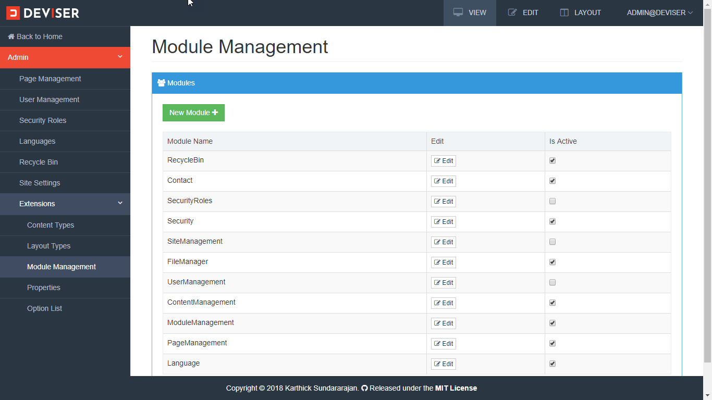
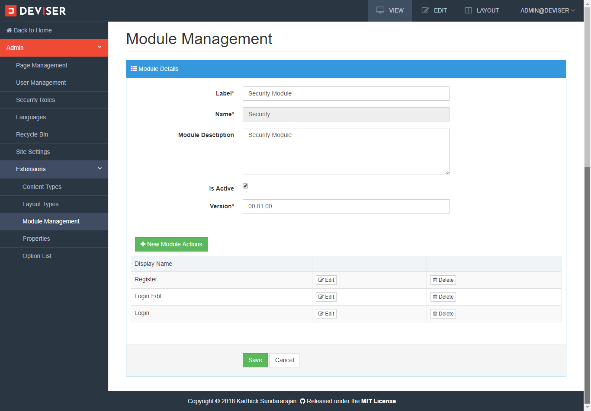
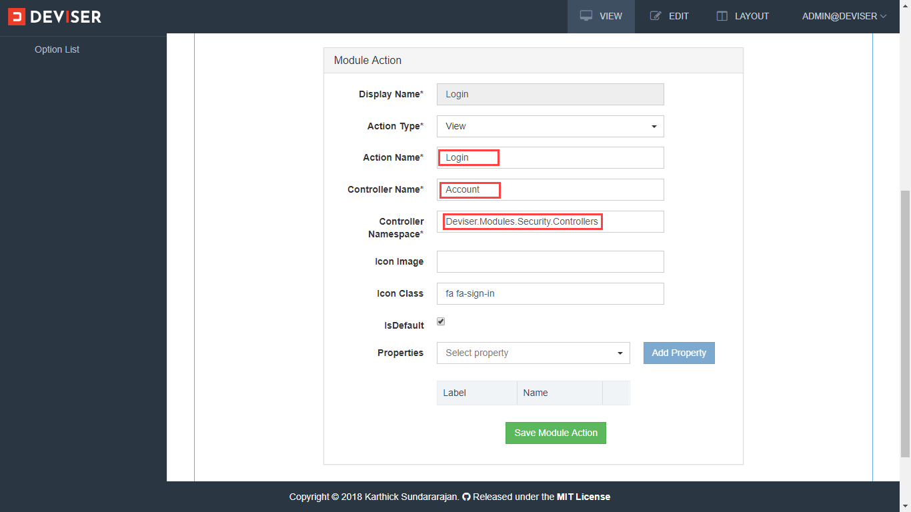
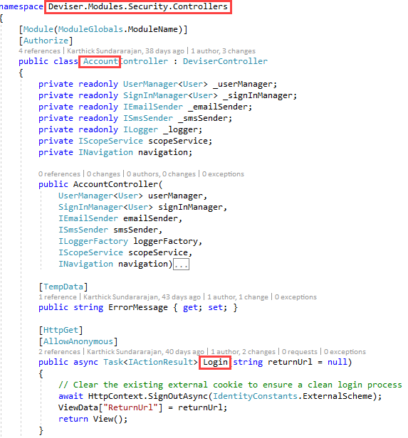
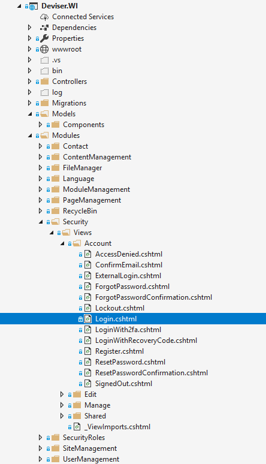
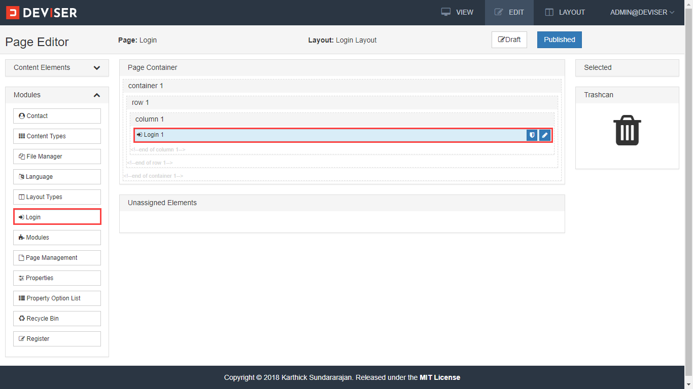
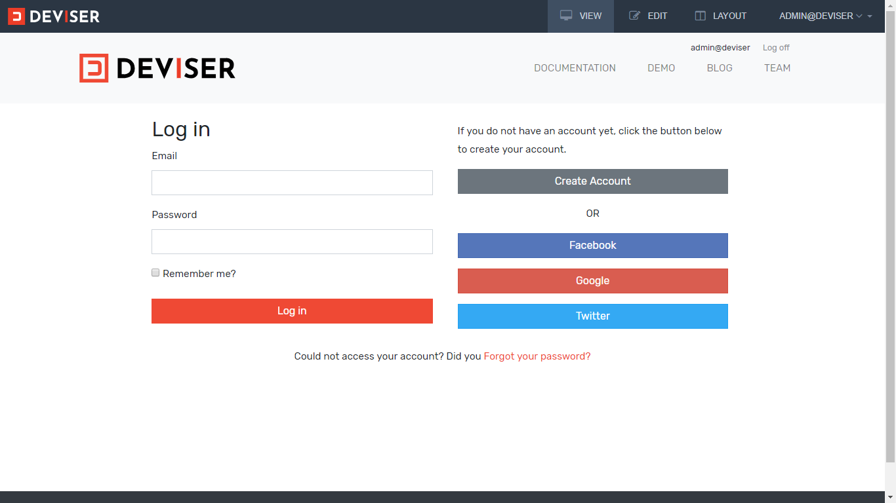

# Modules
Module is a basic building block of the platform and it is used extend the functionalities of the platform. Custom logics and functionalities are implemented and using the modules and those can be resued across the platform.

Modules are extension of ASP.NET MVC Areas, read more about <a href="https://docs.microsoft.com/en-us/aspnet/core/mvc/controllers/areas?view=aspnetcore-2.1" target="_blank">Areas</a> and <a href="https://docs.microsoft.com/en-us/aspnet/core/mvc/overview?view=aspnetcore-2.1" target="_blank">MVC</a>. Routing for the modules are pre-defined, all the modules uses this route `modules/{area:exists}/{controller=Home}/{action=Index}`.

## Module Management
All modules are manged using module management. Navigate to **Admin (click the Deviser logo on top left corner) -> Extensions -> Module Management** to open module management as shown below.

In module management, all the installed modules will be displayed. Here, modules can be created, updated and activated/deactivated. Each module can have one or more module actions. 

>[!NOTE]
>Modules are like a packages and module actions are reusable functional units displayed in edit mode of a page.

## Create / Edit Module
To open module details view, click edit button of a module. The module details view of **Security** module is shown below.

>[!NOTE]
>Name of the module should be unique. Route for this module will be like this `modules/security/{controller=Home}/{action=Index}`

## Module Actions
Module actions are the configuration that maps to the controller actions of a module (in ASP.NET MVC terms Areas). Each module action can be a view or edit action type. View action types are invoked in view mode and edit action types are invoked in edit mode.

For example, the security module consist of two view actions: Register and Login and one edit action: Login Edit. Click edit button of a module action to view details of module action as shown below.

<video class="video-popup"  autoplay muted loop>
  <source src="../../assets/videos/Module_ModuleActionEdit.mp4" type="video/mp4">
  Your browser does not support HTML5 video.
</video>

Here, action name, controller name, controller name space should exactly match with the module developed as shown below

For each module action, one or more properties can be added. Creating and managing properties are explained in [properties](properties.md) section.

>[!NOTE]
>Display Name of the module action should be should be unique. Route for this module will be like this `modules/security/account/login`

## Module Views

Module views are located in `[ApplicationRoot]/Modules/{Module_Name}/Views/{ControllerName}/{ControllerName}/` as shown below

Once the module has been developed and configured, the module actions are listed in left pane of page edit mode as shown below. 

Module can be added to a page by drag-and-drop on configured layout which is similar to adding a content. After adding a module, in view mode, the configured module actions are invoked dynamically at runtime and the action results are loaded in the page within the placeholder as shown below.

