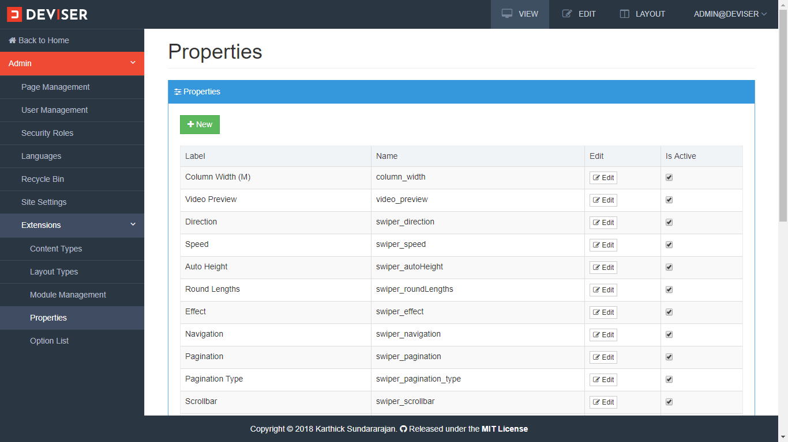
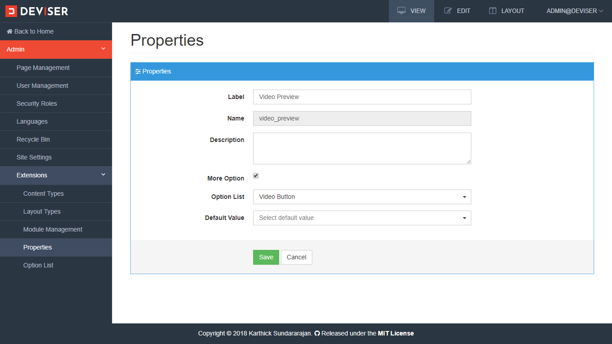
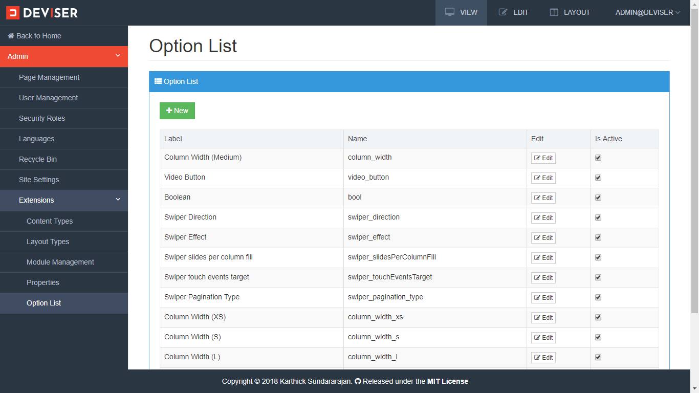
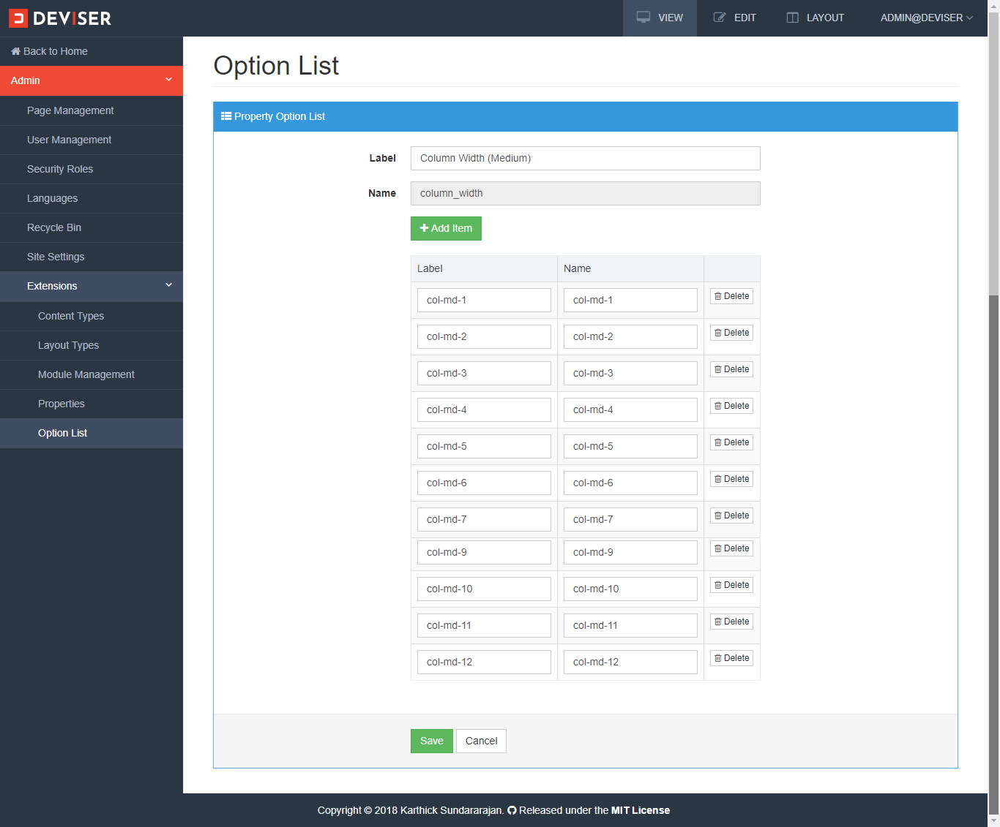

# Properties
Properties are list of attributes which can be used in content types or modules. A property can be single value attribute (e.g css class of a div) or a list attribute (e.g. vertical-alignment). 

## Create Property
To create a property, navigate to **Admin (click the Deviser logo on top left corner) -> Extensions -> Properties**, it will display all properties as shown below.

Here, properties can be created, updated and activated/deactivated. To edit a property, click edit button of a property, property details will be displayes as shown below.

>[!NOTE]
>Name of the property should be unique.

If the property has more options, check more options and select option list and default value form the option list. 

# Option List
Option list is a list of values that can be assigned to a propertiy. Each option list is identified by a name. To create a option list navigate to **Admin (click the Deviser logo on top left corner) -> Extensions -> Option List**, it will open option list page to manage all option list as shown below:

Here, option list can be created, updated and activated/deactivated.To edit a option list, click edit button of a option list, option list details will be displayes as shown below.

>[!NOTE]
>Name of the option list should be unique.

On or more items for the option list can be added by clicking **Add Item** button.