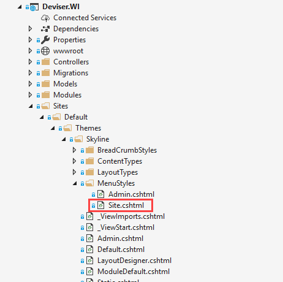

# Themes
A Theme is a wrapper for a page and layout which contains wrapper element and client dependencies required for the theme.

The client dependencies are set of CSS and JavaScript libraries

# How to create a theme
Themes are based on Razor templates. To Create a theme file, navigate to 

## Client Dependency
The client dependeny is used to manage and load the CSS and JavaScripts required by the pages, modules and contents. To load the CSS and JavaScripts require tag helpers are used. 

For example, this code

[!code[Main](../../src/Sites/Default/Themes/Skyline/Default.cshtml?range=15-15)]

loads the `/lib/font-awesome/css/font-awesome.css`CSS in head section of the pages used by **Default.cshtml** theme.

Similarly, JavaScripts can be loaded in head, body begin and body end sections. 

For example this code 
[!code[Main](../../src/Sites/Default/Themes/Skyline/Default.cshtml?range=15-15)]

loads the `/lib/jquery/dist/jquery.js` JavaScript in head section of the pages used by **Default.cshtml** theme.

## Other Components
Themes has some useful components such as Menu and Language switcher

### Menu

The menu component is used to display page navigation. This menu component is based on the TagHelper `dev-nav` as shown below

[!code[Main](../../src/Sites/Default/Themes/Skyline/Default.cshtml?range=54-54)]

`dev-nav` attribute takes the argument menu style. This attribute value and menu style should match as shown below.

`dev-nav-page` is a page selector attribute with attribute values: `All`, `SystemOnly` and `PublicOnly`. `All` selects all pages regardless of system or public pages. `SystemOnly` selects only system pages and `PublicOnly` selects all public pages.

## Language Switcher
The language switcher is used to switch between active languages. This can be included in theme as shown below.

[!code[Main](../../src/Sites/Default/Themes/Skyline/Default.cshtml?range=51-51)]

## Complete Theme

The complete example of the **Default.cshtml** is shown below

[!code[Main](../../src/Sites/Default/Themes/Skyline/Default.cshtml?range=1-)]