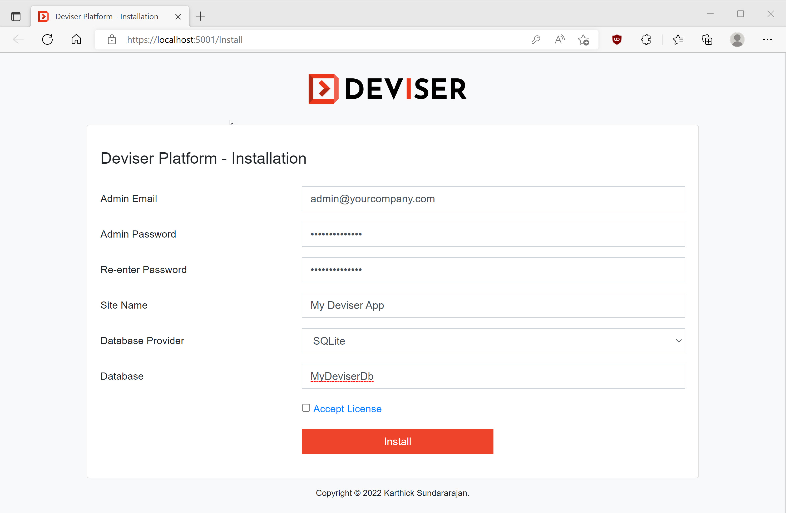

# Get Started

>[!NOTE]
>This guide assumes that readers is familiar with ASP.NET, C#, any of the supported Databases mentioned below.

## Prepare Development Environment

Make sure you have installed <a href="https://dotnet.microsoft.com/en-us/download/dotnet/6.0" target="_blank">.NET 6.0 SDK </a> or above. 

## Creaing a Deviser Application
This section guides you to create first Deivser Application using dotnet cli.
<!-- ### Check everything installed correctly
Once you've installed .NET, open a **new** command prompt or terminal and run the following command:

```bash
dotnet
```

If the installation succeeded, the output should be displayed similar to the following:

```Bash
Usage: dotnet [options]
Usage: dotnet [path-to-application]

Options:
-h|--help         Display help.
--info            Display .NET information.
--list-sdks       Display the installed SDKs.
--list-runtimes   Display the installed runtimes.

path-to-application:
The path to an application .dll file to execute.
``` -->

### Install Deviser templates
```bash
dotnet new --install Deviser.Templates
```
<!-- If the installation succeeded, the output should be displayed similar to the following:


```bash
The following template packages will be installed:
   Deviser.Templates

Success: Deviser.Templates::{version} installed the following templates:
Template Name         Short Name  Language  Tags
--------------------  ----------  --------  -----------
Deviser Platform Web  deviserweb  [C#]      Web/Deviser
``` -->

### Create your first Deviser App

```bash
dotnet new deviserweb -n MyDeviserApp
```
If the installation succeeded, the output should be displayed similar to the following:

```bash
The template "Deviser Platform Web" was created successfully.

Processing post-creation actions...
No Primary Outputs to restore.
```

and then run the Deviser application

```bash
cd MyDeviser App
dotnet run
```
Wait for the app to display that it's listening on http://localhost:<port number> and for the browser to launch at that address.

### Open the URL to install your app 

Fill in basic site adminitration info and click install.



Wait for a while until the installation is complete. Once the installation is successfuly, web application restart is required. you need to run `dotnet run` command once again.

<!-- ## How to install from package
1. Make sure that <a href="https://www.microsoft.com/net/download" target="_blank">.NET Core SDK 2.1</a> has been installed
2. Download the package from github [release](https://github.com/deviserplatform/deviserplatform/releases)
3. Open terminal and enter the command `dotnet Deviser.WI.dll`
4. Open `http://localhost:5000`
5. Follow the installation steps
6. Once the Deviser Platform has been installed, start adding contents and modules. Read more on [Page](pages/index.md)

## How to install from source
### Prerequisites
Deviser Platform is developed on .NET Core and the front-end build tool is based on node.js framework. Therefore, kindly install the following frameworks: 
1. Install <a href="https://www.microsoft.com/net/download" target="_blank">.NET Core SDK 2.1</a>
2. Install <a href="https://nodejs.org" target="_blank">Node.js</a>
3. Install bower `npm install -g bower` 
4. Install gulp-cli `npm install --global gulp-cli`
5. Choose an editor ([Visual Studio](https://visualstudio.microsoft.com/vs/) or [Visual Studio Code](https://code.visualstudio.com/))

### Build from source (Visual Studio)
1. Clone this repository
`git clone https://github.com/deviserplatform/deviserplatform.git`
2. Open DeviserPlatform.sln. Once opened packages will be installed, this may take few minutes
3. Run the Deviser.WI application
4. Follow the Deviser Platform installation steps
5. Once the Deviser Platform has been installed, start adding contents and modules. Read more on [Page](pages/index.md)

### Build from source (Visual Studio Code)
1. Clone this repository
`git clone https://github.com/deviserplatform/deviserplatform.git`
2. Run Deviser Platform 
`dotnet run`
3. Follow the Deviser Platform installation steps
4. Once the Deviser Platform has been installed, start adding contents and modules. Read more on [Page](pages/index.md)


## Suppoted Operating Systems
Deviser Platform is cross-platform which supports following operating systems:
1. Windows, <a href="https://docs.microsoft.com/en-us/dotnet/core/windows-prerequisites?tabs=netcore2x" target="_blank">versions</a>
2. macOS, <a href="https://docs.microsoft.com/en-us/dotnet/core/macos-prerequisites?tabs=netcore2x" target="_blank">versions</a>
3. Linux, <a href="https://docs.microsoft.com/en-us/dotnet/core/linux-prerequisites?tabs=netcore2x" target="_blank">versions</a> -->

## Supported Databases
Deviser Platform is not only cross-platform, but also supports more databases as follows:
1. SQL Server, <a href="https://docs.microsoft.com/en-us/ef/core/providers/sql-server/index" target="_blank">versions</a>
2. SQL Server Local DB, <a href="https://docs.microsoft.com/en-us/ef/core/providers/sql-server/index" target="_blank">versions</a>
3. MySQL, <a href="https://github.com/PomeloFoundation/Pomelo.EntityFrameworkCore.MySql" target="_blank">versions</a>
4. PostgreSQL, <a href="http://www.npgsql.org/doc/compatibility.html" target="_blank">versions</a>
