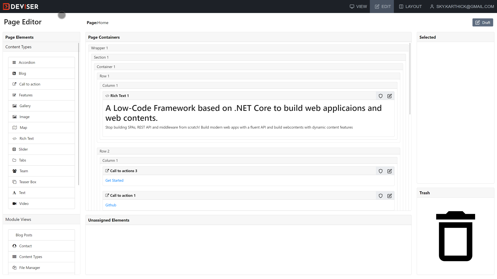
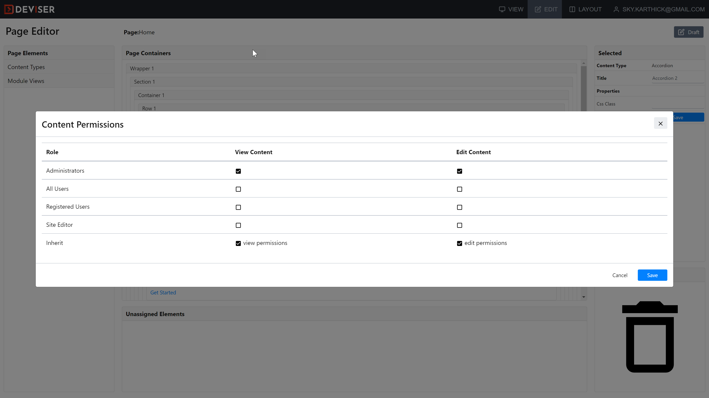

# Pages
Page is a basic building block of the platform which contains modules and contents. To create a page go to **Admin -> Page Management** and add a page, [read more](pages/index.md). Page always has three modes: View, Edit and Layout. To understand the concepts, [read more](concepts.md)
This section explains Edit mode of a page. 

## Edit page
Once the Deviser Platform has been installed and configured with the database, login to the platform. After login, control bar appears on the top of the page as shown below.

The control bar has buttons to switch between three modes: View, Edit and Layout. Click Edit button to switch to edit mode. The edit mode of a page will be like this:

In edit mode, users can add/remove contents/modules in a configured layout. Left pane of the page has all available content elements (content types) and modules. Center pane is also called stage of a page where users can drag-and-drop contents and modules into the stage. The stage always loads the configured layout. To configure layout, [read more] (layouts/index.md).

### Add Content/Module
To add a content/module, just pick a content or a module and drag-and-drop on any appropirate placeholder.

<video autoplay muted loop id="myVideo">
  <source src="../../assets/videos/Page_AddContent.mp4" type="video/mp4">
  Your browser does not support HTML5 video.
</video>

### Content/Module Permissions
User can set role based view/edit permissions for each module/content added in a page. 

### Add/Update properties
Each module/content can have one or more properties. Value of a property can change the behaviour of a module/content. Properties can be updated by simply seleting module/content and changing value in property pane and saving it as shown below

<video autoplay muted loop id="myVideo">
  <source src="../../assets/videos/Page_UpdateProperties.mp4" type="video/mp4">
  Your browser does not support HTML5 video.
</video>

### Remove a content/module

<video autoplay muted loop id="myVideo">
  <source src="../../assets/videos/Page_RemoveContent.mp4" type="video/mp4">
  Your browser does not support HTML5 video.
</video>

### Edit content 

### Edit module